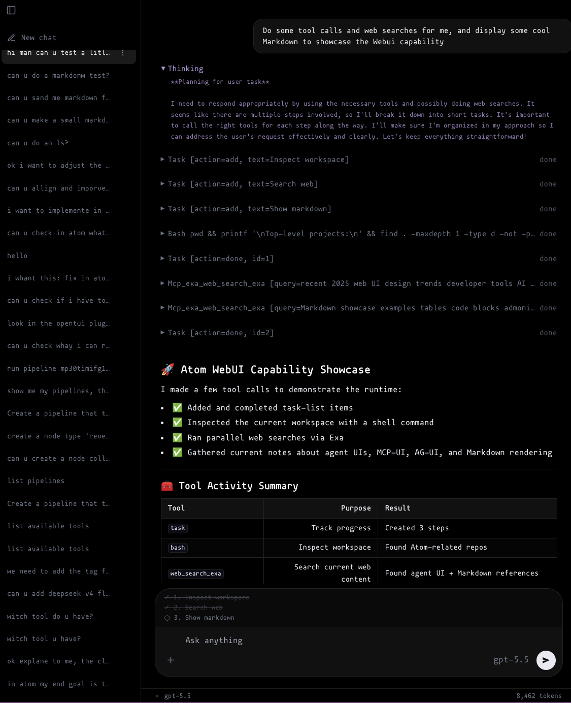
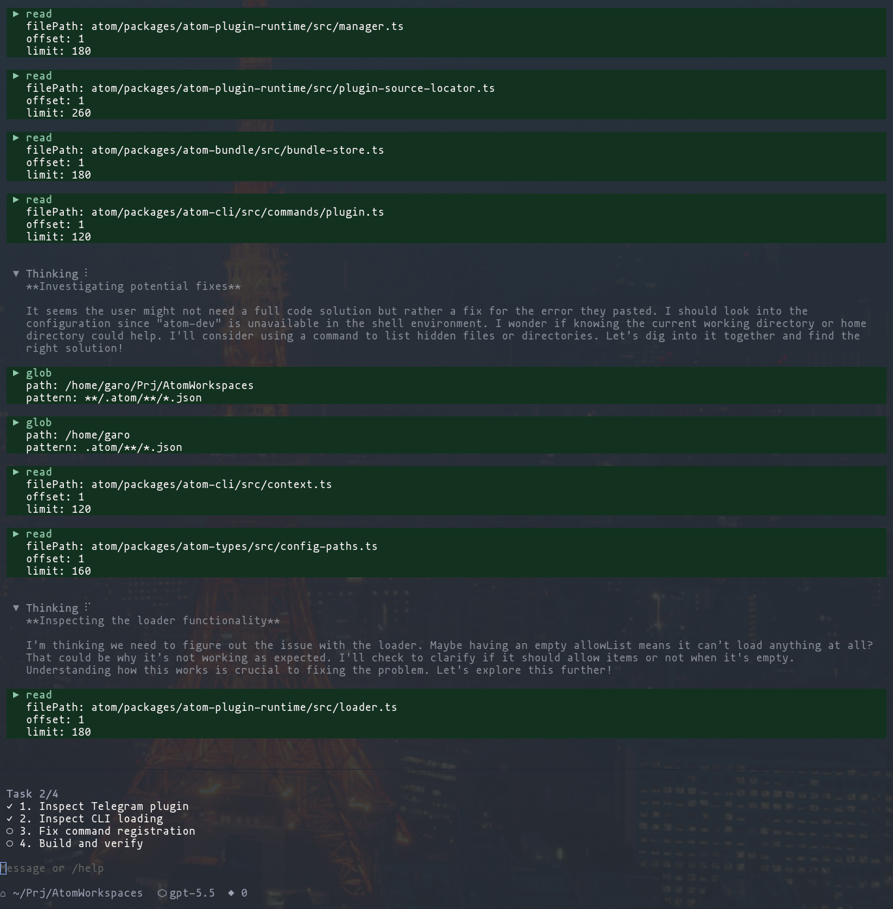
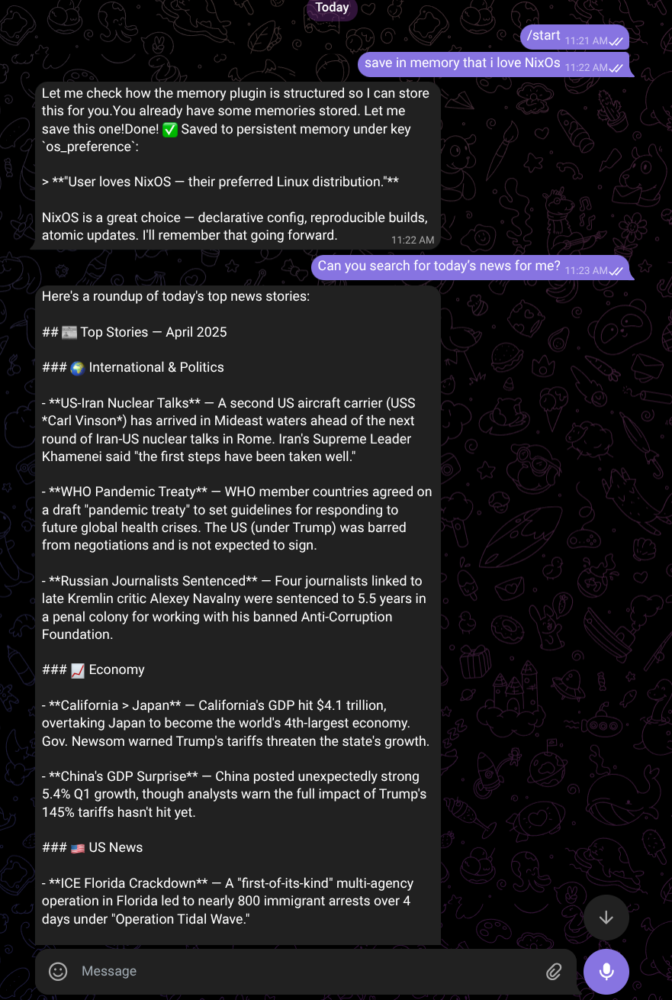

# Atom
Atom is heavily inspired by [Pi](https://github.com/earendil-works/pi).
Atom is a  plugin-driven agent runtime. It can run as a terminal coding assistant, a personal automation worker, or the foundation for a custom agent product.

The runtime stays small and extensible: models provide reasoning, MCP servers provide tools, skills provide instructions, and plugins shape the user experience.

---

## 🖥️ UI Chat Style

With the **Web UI plugin** (`@typegaro/atom-webui`), Atom becomes a full-featured web chat application. Start it with `atom webui`, open your browser at `localhost:3131`, and interact with the agent through a clean, responsive chat interface with streaming responses and conversation history.



---

## 🖱️ Coding Agent Style

With the **OpenTUI plugin** (`@typegaro/atom-opentui`), Atom runs as a rich terminal UI chat client right in your shell. Launch it with `atom opentui` and get a keyboard-driven interface with panels, syntax-highlighted code blocks, and smooth streaming output — a full chat experience without leaving the terminal.



---

## 🦀 OpenClow like Style

With the **Telegram plugin** (`@typegaro/atom-telegram`), Atom can run as a chat-based agent inside Telegram, giving you an OpenClow-like experience from your phone or desktop. Send messages, prompts, and photos to your bot, and Atom answers back through the Telegram channel while still using the same runtime, plugins, tools, memory, jobs, MCP servers, and coding abilities.



This style is perfect when you want Atom to feel like a personal assistant you can reach anywhere — not only in the terminal or browser. Configure the Telegram plugin, connect your bot, and let Atom act through chat.

---

## Why Atom?

- **Plugin-based product surfaces**: add commands, tools, hooks, panels, background jobs, and UI/channel integrations.
- **Flexible model providers**: use ChatGPT Pro / Max, OpenRouter, local OpenAI-compatible servers, or another compatible backend.
- **MCP support**: connect external tools through Model Context Protocol servers.
- **Composable bundles**: switch between named plugin sets for different workflows.

## Installation

Atom is published as `@typegaro/atom` and is intended to run with Bun.

```bash
bun add -g @typegaro/atom
```

Verify the install:

```bash
atom --help
```

## Quick start

1. Add a provider with `atom login <provider>`:

   ```bash
   atom login deepseek
   ```

   You can also use `atom login codex`, `atom login openrouter`, or `atom login openai-compatible`.

2. List available models:

   ```bash
   atom models
   ```

3. Check your setup:

   ```bash
   atom doctor
   ```

4. Run a prompt:

   ```bash
   atom --provider deepseek --model deepseek-v4-flash chat "Say hello"
   ```

See the [Getting started guide](docs/getting-started.md) for provider setup, plugins, bundles, MCP, skills, and custom plugin scaffolding.

## Plugins and bundles

Install plugins globally for your default setup:

```bash
atom plugin install <package-spec>
```

Install plugins only for the current project:

```bash
atom plugin install --local <package-spec>
```

Create and use a bundle:

```bash
atom bundle create my-bundle <plugin-name>
atom --bundle my-bundle --provider <provider-name> --model <model-id> chat "Your prompt"
```

Use `atom plugin list` to see discovered plugin names. See [Getting started](docs/getting-started.md#use-bundles) for local bundles and plugin-provided commands.

## Useful commands

```bash
atom login deepseek
atom login codex
atom login openrouter
atom login openai-compatible
atom models
atom doctor
atom --provider <provider-name> --model <model-id> chat "Your prompt"

atom plugin list
atom plugin install <package-spec>
atom plugin install --local <package-spec>
atom plugin uninstall <package-name>

atom bundle list
atom bundle create <bundle-name> <plugin-name>...
atom bundle add <bundle-name> <plugin-name>
atom bundle remove <bundle-name> <plugin-name>
atom bundle tag <bundle-name> <tag>
atom bundle untag <bundle-name> <tag>
atom bundle delete <bundle-name>

atom init plugin my-plugin
```

## Documentation

- [Getting started](docs/getting-started.md)
- Providers
  - [ChatGPT Pro / Max](docs/providers/chatgpt-pro-max.md)
  - [OpenRouter](docs/providers/openrouter.md)
  - [OpenAI-compatible providers](docs/providers/openai-compatible.md)
- Public packages
  - [`@typegaro/atom`](packages/atom-cli/README.md)
  - [`@typegaro/atom-plugin`](packages/atom-plugin/README.md)
  - [`@typegaro/atom-types`](packages/atom-types/README.md)

## Packages

This repository publishes three public packages:

| Package | Purpose |
| --- | --- |
| `@typegaro/atom` | Bun-first CLI users install and run as `atom`. |
| `@typegaro/atom-plugin` | Public SDK for plugin authors. |
| `@typegaro/atom-types` | Shared public event, session, message, tool, and config path types. |

## Development

Install dependencies:

```bash
bun install
```

Run the CLI from source:

```bash
bun run atom --help
```

Run checks:

```bash
bun run check
```

Build public packages:

```bash
bun run build:public
```

## Project status

Atom is under active development. Public APIs may evolve as the runtime, CLI, and plugin SDK mature.
